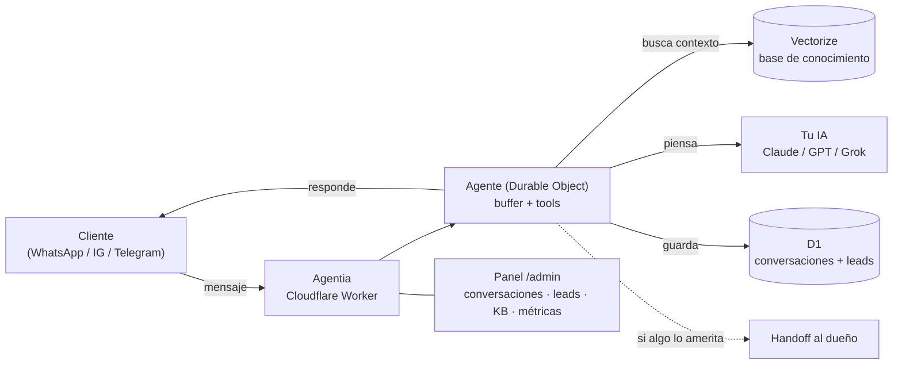

<div align="center">

# 🤖 Agentia

#### Un proyecto de RF Consultoria Integral

### Tu chatbot de IA para WhatsApp, Instagram y Telegram — en **tu propia nube**, sin mensualidades de SaaS.

**Atiende a tus clientes 24/7, responde desde tu base de conocimiento, y te avisa a ti cuando algo lo amerita.** Vive en tu cuenta de Cloudflare, con tu llave de IA. Tus datos son tuyos.

<em>Self-hosted AI support bot for small businesses. Lives in **your** Cloudflare, uses **your** AI key. Spanish-first. Deploy in minutes.</em>

[](./LICENSE)
[](https://workers.cloudflare.com/)
[](https://github.com/Consultoriaintegralrf)

[**Instalar**](#-instalar-en-5-minutos) · [**Cómo funciona**](#-cómo-funciona) · [**Privacidad**](#-privacidad--quién-ve-los-datos)

</div>

---

## ¿Qué es Agentia?

Un asistente de soporte con IA que montas **en tu propia infraestructura de Cloudflare** en una tarde. En lugar de pagar una mensualidad a un SaaS que se queda con tus conversaciones, Agentia vive en tu cuenta, con tu llave de IA, y **todo es tuyo**.

- 💬 **Multicanal** — WhatsApp, Instagram, Messenger y Telegram desde un mismo cerebro.
- 📚 **Aprende de tus documentos** — subes tus FAQ, políticas y guías; el bot busca ahí antes de responder (RAG con base vectorial).
- 🎙️ **Entiende notas de voz** — transcribe los audios de tus clientes automáticamente.
- 🙋 **Sabe cuándo pedir ayuda** — si algo es delicado o no está seguro, te hace *handoff* a ti.
- 📊 **Panel de administración** — conversaciones, leads, base de conocimiento y métricas, todo en `/admin`.
- ☁️ **Vive en tu Cloudflare** — rápido, barato y sin servidores que mantener.
- 🧠 **Tu cerebro, tu llave** — Claude, ChatGPT o Grok; tú eliges y pagas solo lo que piensa.
- 🔒 **Endurecido** — webhooks firmados por canal, rate limiting y freno automático de presupuesto de IA.

> Agentia se instala y configura con [Claude Code](https://claude.com/claude-code) como copiloto — te guía paso a paso y corre los comandos por ti.

---

## 🚀 Instalar en 5 minutos

```bash
git clone https://github.com/Consultoriaintegralrf/agentia mi-chatbot
cd mi-chatbot
pnpm install
# Configura wrangler.toml (nombre de tu worker) y tus secretos
npx wrangler d1 create agentia_bot_db          # → pega el database_id en wrangler.toml
npx wrangler vectorize create agentia_bot_kb --dimensions=1024 --metric=cosine
npx wrangler r2 bucket create agentia-bot-catalog
npx wrangler secret put ANTHROPIC_API_KEY      # (o OPENAI/XAI)
npx wrangler secret put DASHBOARD_PASSWORD
npx wrangler secret put KB_REINDEX_TOKEN
pnpm db:apply:remote
pnpm run deploy
```

Tu panel queda en `https://<tu-worker>.workers.dev/admin`.

[](https://deploy.workers.cloudflare.com/?url=https://github.com/Consultoriaintegralrf/agentia)

Si vas a conectar Telegram, Twilio (WhatsApp) o ManyChat, revisa los secretos de firma de webhook (`TELEGRAM_WEBHOOK_SECRET`, `MANYCHAT_WEBHOOK_SECRET`) comentados en `wrangler.toml` — sin ellos, esos canales rechazan los mensajes entrantes por diseño (fail-closed).

---

## 💸 Cuánto cuesta

Lo único que pagas es tu propia infraestructura, y arranca casi en cero:

| Pieza | Costo | Notas |
|---|---|---|
| **Cloudflare** (la casa del bot) | **$0** para empezar · ~$5/mes ya con tráfico real | D1, Vectorize y R2 tienen capa gratis generosa |
| **Cerebro de IA** (tu llave) | ~**$1–2/mes** para un negocio normal | Pagas solo lo que el bot piensa; tu llave, cifrada en tu Cloudflare |

Nadie más toca tus datos ni tus conversaciones.

---

## 🧠 Cómo funciona



Un mensaje entra por un canal → se valida que venga realmente de ese canal (firma/secreto por webhook) → el agente arma contexto desde tu base de conocimiento → tu IA redacta la respuesta con la voz de tu negocio → se responde y se guarda. Si algo es delicado, te avisa a ti.

---

## 🧩 Stack

- **[Cloudflare Workers](https://workers.cloudflare.com/)** (Hono) — el runtime del bot.
- **[Vercel AI SDK](https://sdk.vercel.ai/)** — capa de LLM (Anthropic / OpenAI / xAI, con llave propia).
- **D1** (SQLite) — conversaciones, leads, configuración, rate limiting.
- **Vectorize** (bge-m3) — base de conocimiento / RAG.
- **R2** — media (imágenes, audios).
- **Durable Objects** — el agente que piensa y responde (buffer + tools).

Todo en el ecosistema de Cloudflare: un solo `pnpm run deploy` y está en línea.

---

## 🔒 Privacidad — quién ve los datos

**Nadie más que tú.** Agentia corre en TU cuenta de Cloudflare con TUS llaves: las conversaciones de tus clientes viven en tu base de datos y **el bot no envía telemetría ni datos de uso a nadie**. No hay ping de activación ni analíticas ocultas — puedes revisarlo tú mismo en `src/`.

- Los **mensajes se borran solos a los 90 días** (cron diario). Los leads y tickets se quedan hasta que tú los borres.
- **No se guardan audios ni imágenes**: se transcriben o describen y solo queda el texto.
- Los links del bot cuentan clics, **sin IP ni navegador**.
- El texto de la conversación sí viaja al **proveedor de IA que tú elegiste** (con tu llave) para poder responder.
- Si preguntan si es un bot, **el bot lo admite**. No lo configures para negarlo.

Como dueño del negocio, **tú eres el responsable** de esos datos: avisa a tus clientes que la atención es automatizada y que guardas la conversación, y atiende las solicitudes de borrado. Todo el detalle está en [`PRIVACY.md`](./PRIVACY.md).

---

## 🤝 Contribuir

Lee [`CONTRIBUTING.md`](./CONTRIBUTING.md) para el flujo, y abre un issue si tienes una idea o encuentras un bug.

## 📄 Licencia

[MIT](./LICENSE).

<div align="center">

---

**Hecho con 🤖 por [RF Consultoria Integral](https://github.com/Consultoriaintegralrf)** · ¿Dudas o quieres que te lo instalemos? [consultoriarf83@gmail.com](mailto:consultoriarf83@gmail.com)

</div>

