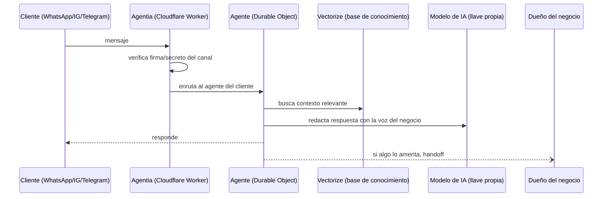

<div align="center">

# 🤖 Agentia

**Metodología y plataforma de RF Consultoria Integral para desplegar agentes de IA de atención al cliente — en la nube del propio negocio, no en la nuestra.**

[](./LICENSE)
[](https://workers.cloudflare.com/)
[](https://github.com/Consultoriaintegralrf)

[**Arquitectura**](#arquitectura) · [**Seguridad**](#seguridad-primero-no-como-anexo) · [**Instalación**](#instalación) · [**Privacidad**](#privacidad)

</div>

---

## El problema que resolvemos

Un negocio que atiende por WhatsApp, Instagram y Telegram termina con tres chats abiertos, un empleado copiando y pegando las mismas respuestas, y cero visibilidad de qué preguntan realmente los clientes. Las alternativas de mercado son SaaS: tus conversaciones — y las de tus clientes — viven en el servidor de un tercero, con una mensualidad fija sin importar cuánto uses el bot.

**Agentia** es nuestra respuesta a eso: un agente de IA que se despliega **dentro de la infraestructura del propio negocio** (Cloudflare), con **su propia llave de modelo de IA**, y que nosotros configuramos, endurecemos y dejamos operando. El negocio es dueño de sus datos desde el día uno — nosotros somos quienes lo montamos, no quienes se los quedan.

## Qué hace

| | |
|---|---|
| 💬 **Multicanal real** | WhatsApp, Instagram, Messenger y Telegram atendidos por el mismo cerebro, con el mismo historial por cliente. |
| 📚 **Contexto propio (RAG)** | Responde desde los documentos del negocio (FAQ, catálogo, políticas) indexados en una base vectorial, no desde lo que el modelo "cree" saber. |
| 🎙️ **Voz e imagen** | Transcribe notas de voz y analiza imágenes de producto antes de responder. |
| 🙋 **Escalamiento con criterio** | Si detecta algo delicado o fuera de su alcance, hace *handoff* a una persona en vez de improvisar. |
| 📊 **Panel operativo** | Conversaciones, leads, base de conocimiento, costos de IA y métricas — todo en `/admin`, sin planilla aparte. |
| 🧠 **Modelo intercambiable** | Anthropic, OpenAI o xAI — se paga la llave propia del negocio, no una capa de margen nuestra sobre el consumo. |

## Seguridad primero, no como anexo

Cuando adaptamos esta plataforma para nuestros clientes, la primera pasada no fue de marca — fue una auditoría de seguridad. Lo que trae Agentia de fábrica que una plantilla genérica normalmente no trae:

- **Cada canal verifica su propio origen.** Telegram, WhatsApp/Twilio y ManyChat validan firma o secreto compartido en cada webhook antes de procesar un solo mensaje — nada entra sin probar que viene de donde dice venir.
- **Rate limiting por IP** en los webhooks y en los endpoints administrativos, para que una ráfaga de tráfico no se traduzca en factura de IA.
- **Freno automático de presupuesto**: si el gasto mensual de IA se dispara, el bot se pausa solo y avisa al dueño — no sigue gastando en silencio hasta el corte de tarjeta.
- **Cero telemetría hacia nosotros.** No hay ping de activación, no hay analítica oculta enviándonos datos del negocio del cliente. Es auditable línea por línea en `src/`.

## Instalación

```bash
git clone https://github.com/Consultoriaintegralrf/agentia mi-chatbot
cd mi-chatbot
pnpm install

# Aprovisiona tu infraestructura en Cloudflare
npx wrangler d1 create agentia_bot_db          # → pega el database_id en wrangler.toml
npx wrangler vectorize create agentia_bot_kb --dimensions=1024 --metric=cosine
npx wrangler r2 bucket create agentia-bot-catalog

# Secretos (nunca en el código, siempre vía wrangler)
npx wrangler secret put ANTHROPIC_API_KEY      # o OPENAI_API_KEY / XAI_API_KEY
npx wrangler secret put DASHBOARD_PASSWORD
npx wrangler secret put KB_REINDEX_TOKEN

pnpm db:apply:remote
pnpm run deploy
```

El panel queda en `https://<tu-worker>.workers.dev/admin`.

[](https://deploy.workers.cloudflare.com/?url=https://github.com/Consultoriaintegralrf/agentia)

Si vas a conectar Telegram o ManyChat, configura también `TELEGRAM_WEBHOOK_SECRET` / `MANYCHAT_WEBHOOK_SECRET` (comentados en `wrangler.toml`) — por diseño, esos canales rechazan cualquier mensaje entrante hasta que el secreto está puesto.

> ¿Prefieres que lo hagamos nosotros? Es literalmente a lo que nos dedicamos — escríbenos (abajo) y lo dejamos operando por ti.

## Arquitectura



Todo corre sobre Durable Objects (un agente con estado por conversación), D1 (SQLite) para conversaciones y leads, Vectorize para la base de conocimiento y R2 para media — el paquete completo de Cloudflare, sin servidores propios que mantener ni pipeline de despliegue aparte del `pnpm run deploy`.

## Stack

| Capa | Tecnología |
|---|---|
| Runtime | Cloudflare Workers + [Hono](https://hono.dev/) |
| Agente con estado | Durable Objects |
| LLM | [Vercel AI SDK](https://sdk.vercel.ai/) — Anthropic / OpenAI / xAI |
| Base de conocimiento | Vectorize (embeddings `bge-m3`) |
| Datos operativos | D1 (SQLite) |
| Media | R2 |

## Costos

No hay mensualidad de producto — se paga la infraestructura propia, que arranca casi en cero:

| Concepto | Costo aproximado |
|---|---|
| Cloudflare (Workers, D1, Vectorize, R2) | $0 para empezar · ~$5/mes con tráfico real |
| Modelo de IA (llave propia) | $1–2/mes para un negocio típico |

## Privacidad

Las conversaciones viven en la cuenta de Cloudflare del negocio, no en la nuestra ni en la de nadie más:

- Los mensajes se autoborran a los **90 días**; leads y tickets se conservan hasta que el dueño los borra.
- No se guardan audios ni imágenes — se transcriben/describen y solo queda el texto.
- El texto de la conversación viaja únicamente al proveedor de IA elegido, con la llave del propio negocio.
- El bot se identifica como bot si se le pregunta — no está configurado para negarlo.

El dueño del negocio es el responsable de esos datos frente a sus clientes (avisar que la atención es automatizada, atender solicitudes de borrado, etc.). Detalle completo en [`PRIVACY.md`](./PRIVACY.md).

## Sobre RF Consultoria Integral

Somos una consultora que implementa infraestructura de IA para negocios — Agentia es la plataforma que usamos para dejar agentes de atención al cliente operando de forma segura, en la nube del propio cliente. [`CONTRIBUTING.md`](./CONTRIBUTING.md) explica cómo reportar un bug o proponer una mejora.

---

<div align="center">

**RF Consultoria Integral** · [rfconsultoriaintegral.com.mx](https://rfconsultoriaintegral.com.mx) · [GitHub](https://github.com/Consultoriaintegralrf)

[MIT](./LICENSE)

</div>
